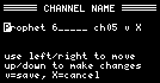

# Roudi

Roudi is a **ROU**ter for mi**DI** messages, created for the [Blokas midiboy](https://blokas.io/midiboy/).

 

I wrote this to make it easier to use my digital piano as a master keyboard.  
Without having to go through a computer.  

Highlights:
- Easily switch the output channel. Name the channels.
- Setup splits and layers.
- Filter out unwanted MIDI messages.
- Includes a MIDI monitor.
- Setup a velocity curve for your master keyboard.
- Auto save of settings.

Lowlights:
- Only DIN MIDI, no USB MIDI.
- Due to the limitations of the midiboy, Roudi is somewhat limited in functionality and ease of use. Because most of the program storage space has been used, it will be quite hard to add extra functionality.

# Changelog

## version 1.0

- Initial release (private)

## version 1.1

- First public release.
- Added a page to edit velocity curves in SETTINGS.
- MULTI:
  - The split note can now be set using the keyboard.
  - Pitch bend can now be mapped to channel aftertouch, by setting the "Pitch bend" value to "at".  
    This is useful if your master keyboard does not send aftertouch.

# Getting Started

Roudi listens on a single input channel and converts its messages to output messages on other channels.  
It is probably best to start with setting that *Input channel**. To do this:

1. Connect the DIN MIDI output of your master keyboard to the MIDI IN of your Midiboy.  
2. Connect the MIDI OUT of your Midiboy to your synths, MIDI thru box, ...
3. Switch on the Midiboy. You'll see the SINGLE page:  
  

4. Press and release **A+B** to switch to the utility pages.
5. Press **B** until you are in the SETTINGS page:  
  

6. Using the **left** or **right** buttons, set the *Input channel* to the output channel of your connected master keyboard.
7. There is no need to save anything. The setting is instantly activated.
8. Switch back to the SINGLE page by pressing **A+B**.
9. You can now switch the output channel using the **up** and **down** buttons.

# Button Bindings

Roudi is based on *pages*. These are screens that do stuff. Use 
- **A** to go to the previous page.
- **B** to go to the next page.

Roudi has two types of pages: 
  1. [*Play pages*](#play-pages): pages for playing music ([SINGLE](#single-page), [MULTI](#multi-page), ...) 
  2. [*Utility pages*](#utility-pages): pages for monitoring and setting up Roudi ([SETTINGS](#settings-page), [MONITOR](#monitor-page), ...)

You can switch between the two types by pushing (and quickly releasing) **A + B** combined.  

Inside the pages, you can use:
- **left** and **right** to modify values.
- **up** and **down** to switch between fields and/or scroll up and down.

# Play Pages

These pages are used when you want to play music.  
Press and release A+B to switch to the utility pages.

# SINGLE page

Use this page if you just want to directly play a single instrument.

- Use **up** and **down** to move up and down through the list. Selecting a channel will route the output to that channel.
- A special value **none** is available that blocks the input channel. This is useful if you just want to play the built-in sound generator of your master keyboard without sending MIDI to another synth.
- At the bottom, there is a **> Panic!** entry which can be used like a MIDI Panic Button by pushing **left** or **right** on it. If at any time notes get stuck on your equipment, using panic should silence them.
- When you have selected one of the 16 channels you can change its name by pushing either **left** or **right**. You'll see the following page pop up:

  

  - Use **left** and **right** to move the cursor.  
  - Use **up** and **down** on the text field to cycle through possible characters. You can use spaces (keep on pushing **up**). The name ends at the underscore (keep on pushing **down**). 
  - To save the name, push **up** or **down** on the **v**.  
  - To cancel the naming, push **up** or **down** on the **X**.  
  - An interesting feature is that you can change the channel to which you want to save the name. Do this by pushing **up** and **down** on the **ch??** field. This is particularly useful if you are moving a synth to a new channel.

# MULTI page

Use this page if you want to combine two instruments/sounds at the same time.  
You can also use it to have more control over a single instrument.  
As an added benefit, you can save several MULTIs, up to 12 to be exact. This can be useful as you might want to recall specific setup now and then. Every new MULTI becomes a new page. As with the other pages, you use the **A** and **B** buttons to switch between them. All MULTIes have a name and a number.

  

- Use **up** and **down** to jump between fields. **left** and **right** to change values.
- **Mode**:
  - _split_ splits the keyboard in two, the lower notes going to the **Left** channel, the higher to the **Right**.
  - _layer_ sends all notes to both **Left** and **Right** channel.
  - _left_ sends only to the **Left** channel.
  - _right_ sends only to the **Right** channel.
- **Split at**: Only available when **Mode** is set to _split_, this defines the key on the keyboard where the higher notes start. You can set it by selecting it and changing the value with the **left** and **right** buttons or by pressing a key on the keyboard.
  NOTE: you cannot play properly when you have selected **Split At**, because Roudi will be constantly updating the value 
- **Left**: The channel known as the left channel.
- **Right**: The channel known as the right channel. (If you select the same right channel as the left channel when in _layer_ of _split_ mode, only the left channel will be used.)
- The next fields are all double. The value to the left concerns the left channel, the other one the right channel. 
  - **Octave**: Transpose the channel up or down by the specified amount of octaves. (Sorry, no semitones.)
  - **Pitch bend**: Enable (_on_) or disable (_off_) routing pitch bend to the channel. Or map pitch bend to channel aftertouch (_at_). The latter is useful when your master keyboard does not send aftertouch, but you want to check the aftertouch functionality of a MIDI device. (Overrides the pitch bend filter in the [SETTINGS](#settings-page).)
  - **Mod wheel**: Enable (_on_) or disable (_off_) routing mod wheel to the channel. (Overrides the mod wheel filter in the [SETTINGS](#settings-page).)
  - **Control change**: Enable (_on_) or disable (_off_) routing control change messages to the channel. (Overrides the cc filter in the [SETTINGS](#settings-page).)
  - **Min velocity**, **Max velocity**: Specify the velocity interval of the notes that should be routed to the output channels. This is mostly used when **Mode** is set to _layer_, because it allows you to sent "silent" notes to one channel and "louder" notes to the other channel.
- More to the bottom you'll notice some specific commands that can be activated by pressing **left** or **right** button om them.
  - **New**: Create an new MULTI called "MULTI" and swith to it.
  - **Move left or right**: Is used to change the order of your MULTIes. Press the **left** or **right** button to move the current MULTI up or down in the list. You'll notice its number changes.
  - **Save as ...**: Pops up a new menu that allows you to (a) name the MULTI, (b) copy it to an existing MULTI or (c) copy it to a new MULTI.

    

    See [SINGLE](#single-page) on how to edit and save the name. MULTIs cannot contain lowercase characters. 
    (b) and (c) are achieved by changing the **mul??** value. If you have a total of four MULTIs, there will be a mul05 value that you can use to save to new slot.
  - **Remove ...**: Pops up a conformation dialogue to allow you to remove the current MULTI. (Note that you cannot remove the last remaining MULTI.)
- At the bottom, there is a **> Panic!** entry which can be used like a MIDI Panic Button by pushing **left** or **right** on it. If at any time notes get stuck on your equipment, using panic should silence them.

# ABOUT page

Some information about Roudi.  
And some very basic help.  
On this page, the input channel is blocked. This is the same as "None" on the SINGLE page.

# Utility Pages

These pages are used when you want to monitor the MIDI messages or setup Roudi.  
NOTE: When you are in a utility page, the MIDI routing defined by the play page from which you switched stays active.
Press and release A+B to switch back to the play pages.

# SETTINGS page

Configure Roudi.

Changes are immediately active and saved.

- **Input channel**: Select the input channel that will be routed to the output. This is typically the output MIDI channel of you master keyboard connected to the MIDI IN of Midiboy.
- **Block other input channels**: Specify whether you want to have Roudi block all input channels not set in **Input channel**.    
  In both cases, messages on the **Input channel** are routed according to the active SINGLE or MULTI.
  - If set to _no_, incoming MIDI messages on other channels are passed to the output channel with the same number. 
  - If set to _yes_, incoming MIDI messages on other channels are discarded.
- **Velocity curve**: Select the velocity curve to use. By default this is a _linear_ mapping: notes with velocity _n_ are also output with velocity _n_. Next to _linear_, three user defined velocity curves are available. 
- **Velocity curve edit**: You can edit the user defined velocity curves by pushing **left** or **right**. This pops up a new menu.  
  Choose one of the _user 1/2/3_ curves to edit by pushing **left** or **right** on them. (You cannot modify _linear_.)  
  This pops up the VELOCITY CURVE EDIT menu:
  
  

  It has the following elements:
  1. The name of the curve you are editing.
  2. X axis representing the input velocity.
  3. Y axis representing the output velocity.
  4. The curve representing the mapping from input to output velocity.
  5. The cursor used to modify the curve. Use **left** and **right** to move to another X position.  
    Use **up** and **down** to move the curve up and down at that position,...
  6. .. you'll see the (x, y) value of that position, meaning if you would strike a key at velocity x it will be sent to the output at velocity y.
  7. The page is interactive in a way that when you strike a key, its input velocity will be drawn with a vertical dotted line ...
  8. ... and the input velocity and output velocity is shown at the right.
  9. If you move the cursor further to the right you can use **up** or **down** to
    - save the curve and exit when on 'v' 
    - exit without saving (=cancel) when on 'X'
    - reset the curve to linear, when on '/'
- **Screen brightness**: By default, Roudi uses full brightness, but you can lower this if so required.
- **Input channel filter**: Controls whether to send particular types of MIDI messages to the output:
  - _pass_means that they are send to the output
  - _block_ means that they are NOT send to the output

  The following messages can be filtered
  - **Note on/off**: played notes
  - **Pitch bend**: pitch bend wheel
  - **Channel pressure**: also called channel aftertouch
  - **Key pressure**: also called polyphonic aftertouch
  - **Program change**: controls the program change (but not the bank change, which is implemented through CC#0!)
  - **Mod wheel**: modulation wheel (this is actually implemented through CC#1)
  - **All other CC**: continuous control change messages, except for CC#1
  - **Time sync**: MIDI clock (F8) and MIDI time code frame (F1)
  - **Transport**: start (FA), continue (FB), stop (FC), song position (F2) and song select (F3)
  - **System exclusive**: system exclusive messages (F0 and F7)
  - **Active sensing**: I'm still alive message (FE)
  - **Other**: Tune request (F0) and system reset (FF)

# MONITOR page

Display incoming and outgoing MIDI messages. A very useful tool for debugging your MIDI setup.

Each line is either an incoming or outgoing MIDI message. They contain the following elements:
- 'i' for input message or 'o' for output message
- channel number
- name and value of the MIDI message  
  In case of control change messages, the CC number is translated into its typical use.

A lot of information can be deduced from the monitor, as shown in the image above:

> You'll see that an A4 is played on channel 1 at velocity 76.  
> This is routed to two output channels: 3 and 4. This is because a MULTI is being used in layer mode.  
> The velocity mapping being used is not linear as the output velocities are 80.  
> You can also see that the note sent to channel 4 is transposed an octave up.  
> The note offs have their own velocity, the release velocity. This is atypical since most keyboards do not measure this value.
>
> After the played note, a control change message #7 with value 84 is sent to both output channels.  
> CC#7 by default controls the volume of a connected device. If the devices on channel 3 and 4 support this CC, they'll change their volume.

You can scroll through the messages using **up** and **down**.  
Note that due to memory limitations, it is impossible to store a huge number of messages.  
Every time you switch away from this page, the buffer is cleared.

System exclusive is currently not displayed.

# MONITOR SETTINGS page
  
Configure the MIDI [MONITOR](#monitor-page) page.

MIDI devices can generate enormous amounts of messages in a short time. To make it easier for you to focus on the interesting ones, this page allows filtering out the unwanted ones.  
To be clear, these messages are still received/sent, just not displayed in the monitor.  
(Note that you can truly filter output messages in the [SETTINGS](#settings-page) page.) 

- **Channels to show**: Select whether you want to display
  - _all_ channels: displays the messages of all 16 input and output channels
  - _routed_ channels: only displays the input messages of the **Input channel** (set in the [SETTINGS](#settings-page) page) and the output messages of the output channel(s) to which the input channel is currently routed 
- **IO to show**: Select whether to show both input and output messages, only input messages or only output messages.
- **Messages**: Select which particular messages are displayed. If you press **left** or **right** here, _hide_ and _show_ are toggled for all message types at once.
  - **Note on**: struck notes
  - **Note off**: released notes
  - **Pitch bend**: pitch bend wheel
  - **Channel pressure**: also called channel aftertouch
  - **Key pressure**: also called polyphonic aftertouch
  - **Program change**: program change (but not the bank change, which is implemented through CC#0!)
  - **Control change**: continuous control change messages, including modulation wheel
  - **Time sync**: MIDI clock (F8) and MIDI time code frame (F1)
  - **Transport**: start (FA), continue (FB), stop (FC), song position (F2) and song select (F3)
  - **System exclusive**: system exclusive messages (F0 and F7)
  - **Active sensing**: I'm still alive message (FE)
  - **Other**: Tune request (F0) and system reset (FF)

# Some General Concepts

- All changes you make are saved automatically. Most of the time, this is really great. Sometimes it is annoying, but this design choice was made to keep things easy and clear.
- The MIDI configuration active on the play page remains active on the utility page. So, e.g. if you are on a MULTI and you switch to the MONITOR, you'll see the output of the MULTI routing.
- There are two conventions for numbering notes in MIDI:
  1. MIDI note 60 = C3
  2. MIDI note 60 = C4 = middle C = 261.63Hz, MIDI note 69 = A4 = 440.00Hz  
  We chose this convention. 
- If you change the MIDI channels of your MIDI instruments, its Roudi channel name will no longer correspond. The easiest way to correct is, is to go into the old name in SINGLE and save it to the new channel number.
- Every time you change the midi configuration, for instance by selecting a channel in single or multi, change octave, velocity, setting, ... note offs are sent to all active MIDI channels. So, basically when you change stuff, any note you are holding on your keyboard will be terminated.
- Panic is implemented by sending an *All Sound Off* message to all 16 output channels. Sadly, not all synthesizers have a full MIDI implementation and might ignore the *All Sound Off* message.

# Cases

If you'd like to have a case for Midiboy and have access to a 3D printer, you can use one of the stls available in the **cases** folder of this repository.  
They are also available on [Thingiverse](https://www.thingiverse.com/thing:4878526).  
There is a basic (named A) and a more advanced case (named B, as seen in the image a the top of this document).  
Note that the repo also contains some stls to print out a stand to tilt the device.

# Programming stuff

Entry into the program is through **Roudi.ino**.

## Building

You need to setup your environment as discussed by Blokas in:
- https://blokas.io/midiboy/software/1/
- https://blokas.io/midiboy/upload/1/

## Debugging and configuration DEFINEs

**Roudi.h** contains several DEFINEs that can be enabled or disabled to control Roudi's configuration.  
They are mostly concerned with memory usage, debugging and default values.

## Memory Usage

The microcontroller used in Midiboy only has 2 KB of RAM and 32 KB of program space.  
I tried to work around these limits as much as possible. In some parts of the sources, this resulted in some weird and not so pretty code.  
Recently, I was able to free some RAM.  
However most of the program space has been used up.  
This makes it difficult to add new features in the future.

## Ideas and Todos

- The filter for program change should include the bank change (which is implemented as CC0).
- Increase the number of stored messages in the MIDI monitor? (Currently 64)
- Have values cycle?
- More extended CC filtering and mapping. => Don't have enought memory for that, I'm afraid. 

There is a more technical todo list in docs/Todo.txt

 
# Credits and License

- Roudi was written by Headphone Cairn Software. 

  

- MIDI libraries and more by [Blokas](https://blokas.io/).
