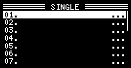
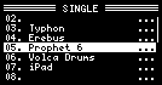
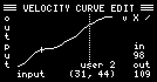

# Roudi

Roudi is a **ROU**ter for mi**DI** messages, created for the [Blokas midiboy](https://blokas.io/midiboy/).

 

I wrote this to make it easier to use my digital piano as a master keyboard.  
Without having to go through a computer.  

Highlights:
- Easily switch the output channel. Name the channels.
- Setup splits and layers.
- Filter out unwanted MIDI messages.
- Includes a MIDI monitor.
- Setup a velocity curve for your master keyboard.
- Auto save of settings.

Lowlights:
- Only DIN MIDI, no USB MIDI.
- Due to the limitations of the midiboy, Roudi is somewhat limited in functionality and ease of use. Because most of the program storage space has been used, it will be quite hard to add extra functionality.

# Changelog

## version 1.0

- Initial release (private)

## version 1.1

- First public release.
- Added page to edit velocity curves.
- The split note can now be set using the keyboard in an MULTI.

# Getting Started

Roudi listens on a single input channel and converts its messages to output messages on other channels.  
It is probably best to start with setting that *Input channel**. To do this:

1. Connect the DIN MIDI output of your master keyboard to the MIDI IN of your Midiboy.  
2. Connect the MIDI OUT of your Midiboy to your synths, MIDI thru box, ...
3. Switch on the Midiboy. You'll see the SINGLE page:  
  

4. Press and release **A+B** to switch to the utility pages.
5. Press **B** until you are in the SETTINGS page:  
  

6. Using the **left** or **right** buttons, set the *Input channel* to the output channel of your connected master keyboard.
7. There is no need to save anything. The setting is instantly activated.
8. Switch back to the SINGLE page by pressing **A+B**.
9. You can now switch the output channel using the **up** and **down** buttons.

# Button Bindings

Roudi is based on *pages*. These are screens that do stuff. Use 
- **A** to go to the previous page.
- **B** to go to the next page.

Roudi has two types of pages: 
  1. *Play pages*: pages for playing music ([SINGLE](#single-page), [MULTI](#multi-page), ...) 
  2. *Utility pages*: pages for monitoring and setting up Roudi ([SETTINGS](#settings-page), [MONITOR](#monitor-page), ...)

You can switch between the two types by pushing (and quickly releasing) **A + B** combined.  

Inside the pages, you can use:
- **left** and **right** to modify values.
- **up** and **down** to switch between fields and/or scroll up and down.

# Play Pages

These pages are used when you want to play music.  
Press and release A+B to switch to the utility pages.

## SINGLE page

Use this page if you just want to directly play a single instrument.

Use **up** and **down** to select the output channel.

You can give a name to the channel by pushing either **left** or **right**. You'll see the following page pop up:

Use **left** and **right** to move the cursor.  
Use **up** and **down** on the text field to cycle through possible characters.  
To save the name, push **up** or **down** on the **v**.  
To cancel the naming, push **up** or **down** on the **X**.  
An interesting feature is that you can change the channel to which you want to save the name. Do this by pushing **up** and **down** on the **ch??** field. This is particularly useful if you are moving a synth to a new channel.
  

## MULTI page

Use this page if you want to combine several instruments into a layer or a split. (Currently we only support two instruments.)  
MULTI also allows you to play a single instrument, like in SINGLE, but with additional functionality such as transposition, ... 

  

- If you select the same channel twice in LAYER of SPLIT mode, only the left channel will be used.
- The pitch bend, mod wheel, ... on/off overrides the same filters in the SETTINGS.

## ABOUT page

- Some information about Roudi
- On this page, the input channel is blocked. This is the same as "None" on the SINGLE page.

# Utility Pages

These pages are used when you want to monitor the MIDI messages or setup Roudi.  
NOTE: When you are in a utility page, the MIDI routing defined by the play page from which you switched stays active.
Press and release A+B to switch back to the play pages.

## SETTINGS page

- Block other channels: 

- Velocity curve. This allows you to change influence the output velocity. It can be useful if your keyboard is not as (or too) responsive as you would like. Note that the velocity mapping is applied **before** the velocity filter in MULTI.
  There are currently four velocity curves available 
  - **linear**: output is the same as input velocity 
  - **expon**ential: output has lower velocity than input
  - **logar**ithmic: output has higher velocity than input
  - **custom**: personalised velocity curve

  

  Graphical representation: 

  

- Screen brightness: Self explanatory.

## MONITOR page

## MONITOR SETTINGS page
  
# Concepts and Notes

- All changes you make are saved automatically.
- The MIDI configuration active on the level on page remains active in the level two page. So, e.g. if you are on a MULTI and you switch to the MONITOR, you'll see the output of the MULTI routing.
- There are two conventions for numbering notes in MIDI:
  1. MIDI note 60 = C3 
  2. MIDI note 60 = C4 = middle C = 261.63Hz, MIDI note 69 = A4 = 440.00Hz
  We chose the second convention. 
- If you change the MIDI channels of your MIDI instruments, its Roudi channel name will no longer correspond. The easiest way to correct is, is to go into the old name in SINGLE and save it to the new channel number.
- Every time you change the midi configuration such as: select a channel in single or multi, change octave, velocity, setting, ... note offs are sent to all active MIDI channels. So, basically when you change stuff, any note you are holding down an your keyboard will be terminated.

# TODO

Filters: 
- program change overrides cc filter for CC0
- mod wheel overrides cc filter for CC1

Allow mode to map mod wheel to aftertouch

# Programming stuff:

#define ENABLE_RAW exist in Debug.cpp
#define ENABLE_DEBUG exists in PageMonitor.cpp
#define SET_DEFAULT_CHANNEL_NAMES exists in Data.cpp

Memory usage

# Cases

If you'd like to have a case for Midiboy and have access to a 3D printer, you can use one of the stls available in the **cases** folder of this repository.  
They are also available on [Thingiverse](https://www.thingiverse.com/thing:4878526).  
There is a basic (named A) and a more advanced case (named B, as seen in the image a the top of this document).  
Note that the repo also contains some stls to print out a stand to tilt the device.

 
# Credits and License

- Roudi was written by Headphone Cairn Software. 

  

- MIDI libraries and more by [Blokas](https://blokas.io/).

